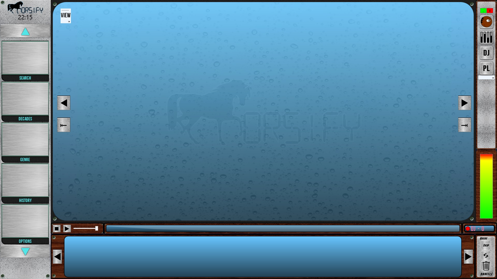

<h1 align="center">HORSIFY 2.0</h1> 
<h4 align="center">WPF, Prism, Sqlite, EFCore, WebApi, Wix</h2>

----------

---

### Requirements

- Windows 7 or later
- VLC Media Player installed x86 - x64

### Quick start (See Wiki for detailed)

- Download & Run Horsify installer ([Latest Artifacts](https://ci.appveyor.com/project/horseyhorsey/horsify-2-0/build/artifacts))
- Run the importer to import a folder of song files
- Run Horsify Jukebox as soon as you have at least one entry
